# Claude-Gemini MCP Server

An MCP (Model Context Protocol) server that enables automated pair programming between Claude Code CLI and Gemini CLI, implementing eXtreme Programming (XP) pair programming patterns.

## 🎯 Purpose

This MCP server orchestrates a collaborative workflow where:
- **Claude Code CLI** acts as the **Driver** (implements code)
- **Gemini CLI** acts as the **Navigator** (reviews and provides feedback)
- **Automated iteration** until code meets quality standards

Perfect for Pine Script development, trading strategies, and any collaborative coding workflow.

## 🚀 Quick Start

### Prerequisites

- Node.js v18+
- Claude CLI installed and configured
- Gemini CLI installed and configured
- Ubuntu Linux (tested environment)

### Installation

```bash
# Install as project dependency
npm install --save-dev github:iamrichardd/claude-gemini-mcp-server

# Add MCP server to Claude CLI
claude mcp add -s project claude-gemini-pair-programmer npx claude-gemini-mcp

# Initialize and approve the MCP server
claude init

# Choose option 1: "Use this and all future MCP servers in this project"
```

### Verify Installation

```bash
# Check if MCP server is registered and connected
claude mcp list

# Should show:
# claude-gemini-pair-programmer    stdio    npx claude-gemini-mcp    ✓ connected
```

### Basic Usage

#### Single Implementation
```
Use claude_implement with prompt "Create RSI indicator" and file_path "./indicators/rsi.pine"
```

#### Code Review Only
```
Use gemini_code_review with file_path "./strategy.pine" and context "Added MACD signals"
```

#### Full Pair Programming Cycle
```
Use pair_programming_cycle with initial_prompt "Create comprehensive RSI+MACD trading strategy" and file_path "./strategy.pine"
```

## 📋 Available Tools

| Tool | Description | Parameters |
|------|-------------|------------|
| `claude_implement` | Execute Claude CLI for implementation | `prompt`, `file_path` (optional) |
| `gemini_code_review` | Execute Gemini CLI for code review | `file_path`, `context` (optional) |
| `pair_programming_cycle` | Full automated pair programming workflow | `initial_prompt`, `file_path`, `max_iterations` (default: 3) |
| `get_session_context` | View current session state | None |

## 🔄 Pair Programming Workflow

```mermaid
graph TD
    A[Initial Prompt] --> B[Claude Implements]
    B --> C[Gemini Reviews]
    C --> D{Code Approved?}
    D -->|Yes| E[✅ Complete]
    D -->|No| F[Generate Improvement Prompt]
    F --> B
    G[Max Iterations?] --> E
```



### Example Output

```
=== ITERATION 1 ===

🚗 CLAUDE (DRIVER) - IMPLEMENTING:
Created RSI+MACD strategy with entry/exit logic

🧭 GEMINI (NAVIGATOR) - REVIEWING:
Issues found:
1. MACD signal calculation needs refinement
2. Add input validation for RSI periods
3. Consider repainting prevention

=== ITERATION 2 ===

🚗 CLAUDE (DRIVER) - IMPLEMENTING:
Fixed MACD calculation and added input validation

🧭 GEMINI (NAVIGATOR) - REVIEWING:
Much improved! Code looks good and follows Pine Script best practices.

✅ GEMINI APPROVAL - Code meets requirements!
```

## 🛠️ Configuration

### Claude CLI MCP Setup

The MCP server integrates with Claude CLI using the `.mcp.json` configuration file:

```bash
# Add MCP server to your project
claude mcp add -s project claude-gemini-pair-programmer npx claude-gemini-mcp

# Alternative: Add with specific Node.js path if needed
claude mcp add -s project claude-gemini-pair-programmer node ./node_modules/@iamrichardd/claude-gemini-mcp-server/server.js

# Initialize and approve MCP servers
claude init
```

### Manual Configuration (if needed)

If automatic setup doesn't work, create `.mcp.json` manually:

```json
{
  "mcpServers": {
    "claude-gemini-pair-programmer": {
      "command": "npx",
      "args": ["claude-gemini-mcp"],
      "transport": "stdio"
    }
  }
}
```

### Troubleshooting MCP Setup

```bash
# Check MCP server status
claude mcp list

# Remove and re-add if needed
claude mcp remove claude-gemini-pair-programmer
claude mcp add -s project claude-gemini-pair-programmer npx claude-gemini-mcp

# Test server manually
npx claude-gemini-mcp
```

### Project-Specific Setup

```bash
# In your project directory
npm init -y
npm install --save-dev github:iamrichardd/claude-gemini-mcp-server

# Add to package.json scripts:
{
  "scripts": {
    "setup-pair-programming": "npx claude-gemini-mcp install-config",
    "start-mcp": "npx claude-gemini-mcp"
  }
}
```

## 📁 Project Structure

```
your-project/
├── node_modules/
│   └── @iamrichardd/claude-gemini-mcp-server/
├── package.json
└── README.md
```

## 🐛 Troubleshooting

### Common Issues

**MCP Server Not Found**
```bash
# Check if properly installed
npm list | grep claude-gemini-mcp-server

# Reinstall configuration
claude mcp add -s project claude-gemini-pair-programmer npx claude-gemini-mcp
claude init
```

**Claude CLI Not Found**
```bash
# Verify Claude CLI installation
claude --version

# Check PATH
echo $PATH | grep claude
```

**MCP Server Failed to Start**
```bash
# Test server manually
npx claude-gemini-mcp

# Check for dependency issues
npm install @modelcontextprotocol/sdk
```

**Gemini CLI Not Found**
```bash
# Verify Gemini CLI installation
gemini --version

# Check configuration
gemini config list
```

## 🤝 Contributing

1. Fork the repository
2. Create feature branch (`git checkout -b feature/amazing-feature`)
3. Commit changes (`git commit -m 'Add amazing feature'`)
4. Push to branch (`git push origin feature/amazing-feature`)
5. Open Pull Request

## 📄 License

MIT License - see [LICENSE](LICENSE) file for details.

## 🔗 Related Tools

- [Claude CLI](https://docs.anthropic.com) - AI-powered code assistant
- [Gemini CLI](https://github.com/google-gemini/gemini-cli) - Google's AI CLI tool
- [Model Context Protocol](https://modelcontextprotocol.io) - Standard for AI tool integration

## 📊 Use Cases

- **Code Review Automation**: Continuous quality improvement
- **Educational**: Learn XP pair programming with AI
- **Rapid Prototyping**: Fast iteration with dual AI feedback

---

Made with ❤️ for the trading and development community
